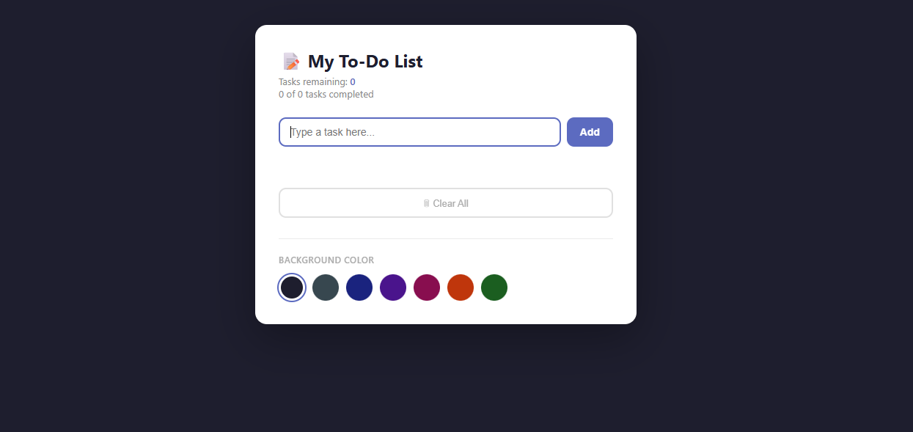

# 📝 To-Do List App

A simple and interactive To-Do List application built with **HTML**, **CSS**, and **Vanilla JavaScript**. The application allows users to add, complete, and delete tasks while keeping track of their progress with live task counters. All task management is handled dynamically using JavaScript and an array of objects, making it a great project for practicing DOM manipulation and event handling.

This project was created to strengthen fundamental JavaScript concepts such as arrays, objects, loops, functions, conditionals, DOM manipulation, event listeners, array methods, and CSS class manipulation. It also includes several bonus features such as duplicate prevention, a background color picker, a "Clear All" button, and a celebration message when every task is completed.

---

## 📸 Screenshot

<p float="left">
  
</p>

---

## 🚀 Live Demo

live demo --> https://hayatabdulfetah.github.io/javascript-todo-list/

---

## ✨ Features

### Core Features

* Add new tasks
* Prevent empty task submission
* Mark tasks as completed or undone
* Delete individual tasks
* Live remaining task counter
* Store tasks in a JavaScript array of objects
* Automatically update the UI whenever the data changes

### Bonus Features

* Clear all tasks
* Prevent duplicate tasks
* Live completed task counter
* Celebration message when all tasks are completed
* Background color picker

---

## 🛠️ Built With

* HTML5
* CSS3
* Vanilla JavaScript (ES6)

---

## 📂 Project Structure

```text
todo-app/
│── index.html
│── style.css
│── script.js
│── screenshot.png
└── README.md
```

---

## 🧠 JavaScript Concepts Practiced

* Variables (`const` and `let`)
* Functions
* Arrays of Objects
* Array Methods

  * `push()`
  * `filter()`
  * `some()`
  * `splice()`
  * `forEach()`
* DOM Manipulation
* Event Listeners
* Template Literals
* `classList`
* `dataset`
* Conditional Statements
* Dynamic Rendering

---

## 📖 How It Works

1. Enter a task in the input field.
2. Click **Add** (or press **Enter**) to create a new task.
3. Mark tasks as completed using the **Done** button.
4. Delete unwanted tasks using the **Delete** button.
5. Monitor your progress using the live task counters.
6. Use **Clear All** to remove every task.
7. Change the page background using the color picker.

---

## 🎯 Learning Objectives

This project demonstrates how to:

* Build an interactive web application using JavaScript.
* Manage application state with an array of objects.
* Dynamically generate HTML elements.
* Update the DOM efficiently after data changes.
* Handle user interactions with event listeners.
* Apply CSS classes dynamically using JavaScript.

---

## 👤 Author

**Hayat**


---

## 📄 License

This project is intended for educational purposes.
